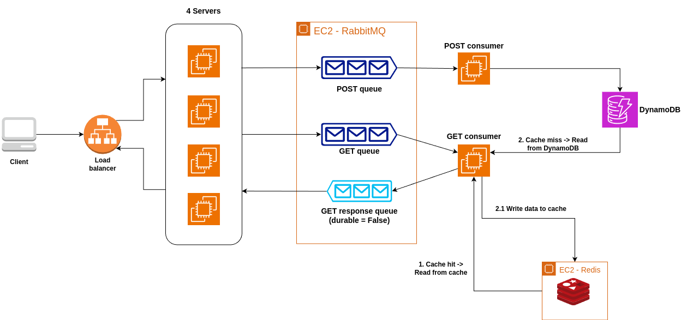
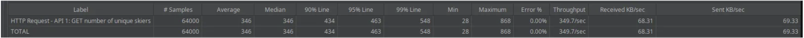
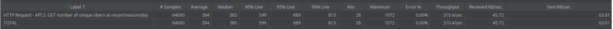
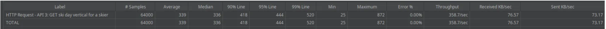
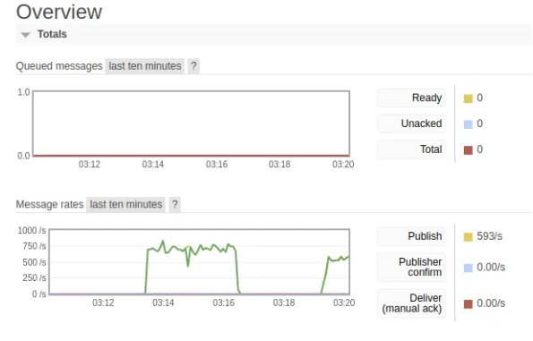
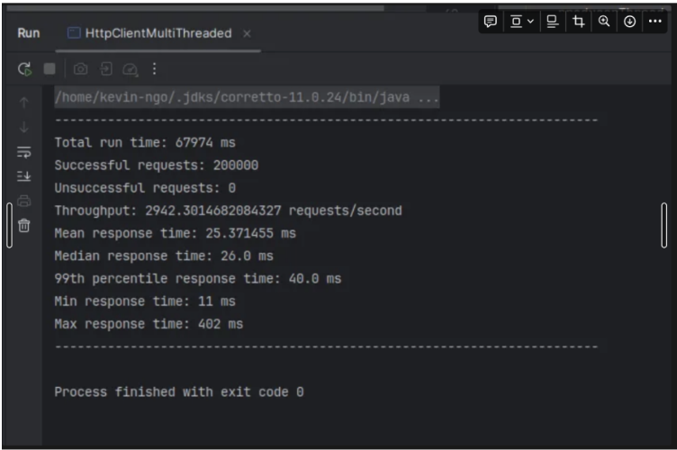
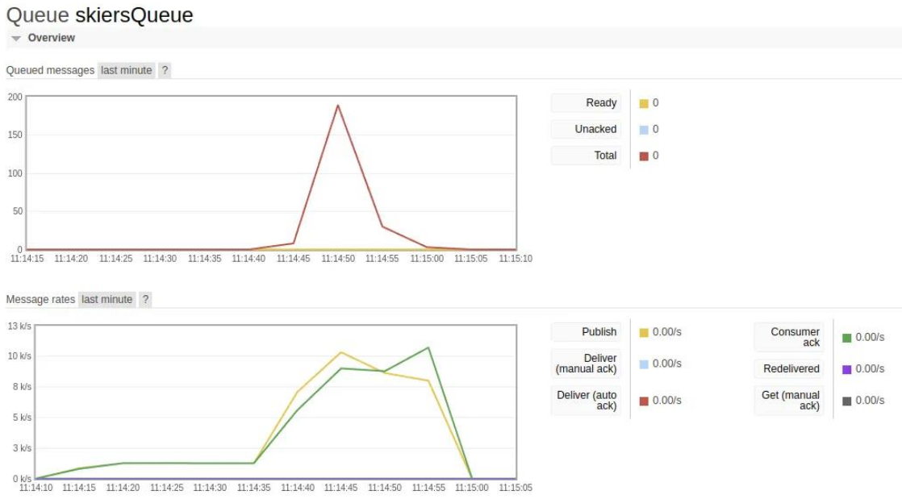
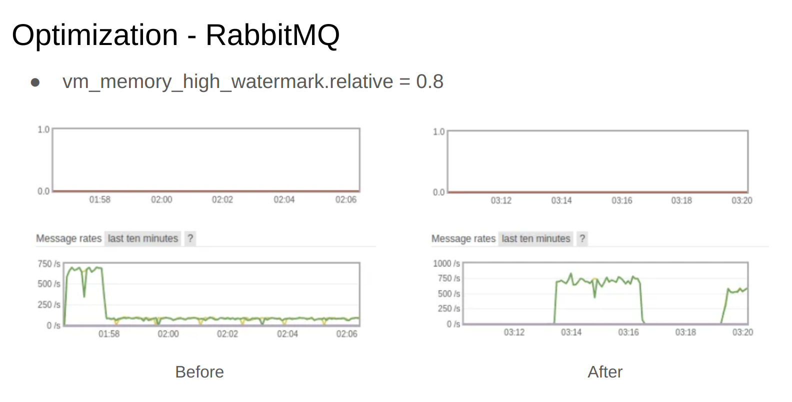

# NUSkier

## Overview
NUSkier is a scalable distributed backend system designed to manage ski resort data efficiently. Built using **Java Servlets** and deployed using **Apache Tomcat**, this system handles high volumes of POST and GET requests with optimized performance, ensuring low latency and high throughput. The architecture leverages **AWS EC2**, **RabbitMQ**, **Redis**, and **DynamoDB** for reliable and efficient data processing.

## Architecture

The system consists of:
1. **Load Balancer**: Distributes incoming requests across API servers.
2. **API server - SkierServlet-rmq**: Handles incoming requests and delegates tasks to workers (consumers).
3. **RabbitMQ**: Manages message queues for delegating tasks to workers based on POST/GET requests.
4. **POST Consumer - SkierConsumer**: Handles POST messages from RabbitMQ and updates records in the DynamoDB database.
5. **GET Consumer - SkierGetConsumer**: Handles GET messages from RabbitMQ, querying and retrieving data from Redis cache and DynamoDB database.
6. **SkierClient**: Multithreaded client used to send 200K POST requests for data generation.

## AWS Deployment
- **EC2 Instances**:
  - API Server: `t3.medium`
  - RabbitMQ: `t3.medium`
  - Consumers: `t3.medium`
  - Redis: `t3.micro`
- **Application Load Balancer**

## API Endpoints (following: [Swagger](https://app.swaggerhub.com/apis/cloud-perf/SkiDataAPI/2.0#/info))
### GET Endpoints:
1. **Get skier data for a specific day**:
   - Endpoint: `/skiers/{resortID}/seasons/{seasonID}/days/{dayID}/skiers/{skierID}`
   - Returns skier activity for a specific day at a given resort.

2. **Get skier vertical for a season**:
   - Endpoint: `/skiers/{skierID}/vertical`
   - Returns the total vertical lift for a skier in a season.

3. **Get all skiers for a specific day**:
   - Endpoint: `/resorts/{resortID}/seasons/{seasonID}/day/{dayID}/skiers`
   - Returns all skiers who visited a resort on a specific day.

### POST Endpoint:
1. **Log a skier's lift ride**:
   - Endpoint: `/skiers/{resortID}/seasons/{seasonID}/days/{dayID}/skiers/{skierID}`
   - Logs lift ride details for a skier.

## DynamoDB Data Schema
### a. Partition and Sort Keys
- **Table Name**: `SkierTable`
- **Partition Key (PK)**: `skierID`
- **Sort Key (SK)**: `resortID#seasonID#dayID#liftID`

### b. Global Secondary Index (GSI)
- **GSI Partition Key (GSI_PK)**: `resortID#seasonID#dayID`

## Redis Keys Design
1. **Unique Skiers per Day**:
   - **Key Format**: `uniqueSkiers:RESORT#{resortID}#SEASON#{seasonID}#DAY#{dayID}`
   - **TTL**: 1000 seconds
   - **Description**: Caches the count of unique skiers visiting a specific resort on a given day.

2. **Day Vertical for a Skier**:
   - **Key Format**: `dayVertical:SKIER#{skierID}:RESORT#{resortID}#SEASON#{seasonID}#DAY#{dayID}`
   - **TTL**: 1000 seconds
   - **Description**: Caches the total vertical lift for a skier on a specific day.

3. **Resort Vertical by Skier**:
   - **Key Format**: `resortVertical:SKIER#{skierID}:RESORT#{resortID}`
   - **TTL**: 1000 seconds
   - **Description**: Caches the total vertical lift for a skier across seasons at a specific resort.

<!-- ## How to Run
1. Clone the repository:
   ```bash
   git clone https://github.com/yourusername/nuskier.git
   ```
2. Build and deploy the project on an Apache Tomcat server.
3. Set up RabbitMQ, Redis, and DynamoDB on AWS, or use local installations.
4. Update the configuration files with appropriate connection details.
5. Use a load testing tool (e.g., JMeter) to simulate traffic and monitor performance. -->

## Load Testing Results
- **GET requests (JMeter):**
  <!-- - Endpoint: `/skiers/{resortID}/seasons/{seasonID}/days/{dayID}/skiers/{skierID}`
  - Average latency: 185ms
  - Throughput: 1,300 requests/second -->
  - JMeter
  
  
  
  </br>
  - RabbitMQ
  


- **POST requests (client report):**
  <!-- - Endpoint: `/skiers/{resortID}/seasons/{seasonID}/days/{dayID}/skiers/{skierID}`
  - Average latency: 200ms
  - Throughput: 2900 requests/second -->
  
  </br>
- RabbitMQ
  

<!-- ## Performance Optimizations
- Implemented multithreaded channel pooling for RabbitMQ to minimize channel creation overhead, keeping queue sizes consistently below ~1,000 messages.
- Fine-tuned RabbitMQ parameters, such as `vm_memory_high_watermark.relative`, for optimal memory usage.
 -->


## Potential Improvements
- Batch processing for message consumption and database queries.
- Further fine-tuning of RabbitMQ and Redis parameters for larger workloads.
- Adding automated scaling for EC2 instances to handle traffic spikes.
